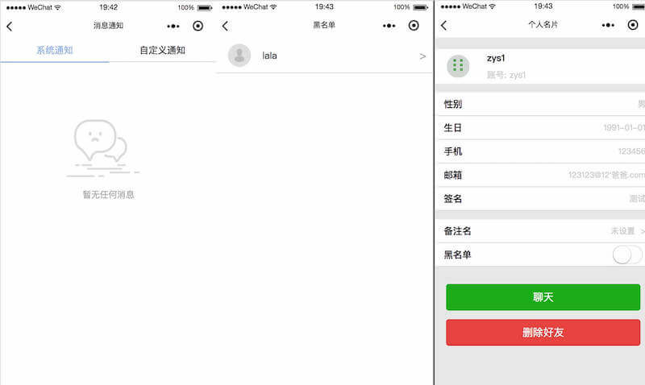

## 介绍

云信IM DEMO 小程序版本 (以下简称小程序 demo)，是一套使用网易云信IM端SDK，基于微信小程序原生开发方式开发的一款类似于微信的聊天小程序。 小程序DEMO的推出，使得云信SDK的开发者们可以更便捷的借助微信渠道推广他们的产品。主要功能点如下：

 登录注册（为了实现不同端同一账号体系，所以没有采用微信授权登录）
- 最近会话展示
- 通讯录
- 单聊对话
- 用户名片

废话不多说直接上图：


一期已经上线，欢迎扫一扫体验：


本项目是基于网易云信聊天室SDK实现的，更多详细介绍可以[前往](http://dev.netease.im/docs/product/IM%E5%8D%B3%E6%97%B6%E9%80%9A%E8%AE%AF/SDK%E5%BC%80%E5%8F%91%E9%9B%86%E6%88%90/Web%E5%BC%80%E5%8F%91%E9%9B%86%E6%88%90/%E6%A6%82%E8%A6%81%E4%BB%8B%E7%BB%8D)查看。

另外基于网易云信chatroom SDK实现的微信小程序也已开发完成，可[前往](https://github.com/netease-im/NIM_Weapp_Chatroom_Demo)查看。

## 运行

下载[微信开发者工具](https://developers.weixin.qq.com/miniprogram/dev/devtools/download.html)，创建新项目，导入即可看到运行效果

## 工程结构

整个微信小程序DEMO目录结构如下：

```shell
|- components 自定义组件目录
|- images 项目中使用的一些高频次图片
|- pages 主功能一级页面
	|- contact 通讯录页
	|- login 登录页
	|- recentchat 最近会话页
	|- register 注册页
	|- setting 设置页
|- partials 二级页面
	|- addfriend 添加好友页
	|- blacklist 黑名单页
	|- chatting 聊天页
	|- forwardcontact 转发消息通讯录页
	|- historyfromcloud 云端历史记录页
	|- messagenotification 消息通知中心页
	|- modify 修改个人资料页
	|- personcard 非陌生人个人名片页
	|- strangercard 陌生人个人名片页
|- utils 存放一些工具类js
	|- config.js 存放项目的基本配置
	|- emojimap.js emoji文本与对应图片的映射关系，自定义emoji组件使用
	|- event.js 观察者模式具体实现
	|- imageBase64.js 存储一些小图标bese64编码
	|- imeventhandler.js 网易IM SDK初始化以及对应的回调函数注册，通过消息发布、订阅与外部通信
	|- pinyin.js 获取汉字的拼音
	|- util.js 一些工具方法的集合
|- vendors 引入外部的库，主要有网易云信 IM 的SDK以及md5加密
|- app.js 小程序根实例，存储了全局中的一些数据
|- app.json 注册页面以及定义页面一些基本样式
|- app.wxss 全局样式
|- project.config.json 设置整个小程序工程的一些属性，包括编译类型(截止2018年3月新增加了微信插件)、基础库版本等
```

## 技术栈的一些思考

这里探讨下目前（截止2018年3月）比较流行的三种开发微信小程序的方式：微信小程序原生、wepy、mpVue


| | 微信小程序 | wepy | mpvue |
| --- | :---: | :---: | :---: |
| 开发规范 | 小程序开发规范 | vue开发规范 | vue开发规范 |
|状态管理|无|无|vuex|
|组件化|比较原始|自定义组件规范|vue组件|
|多端复用|不可|可转化为H5|可转化为H5|
|构建方式|开发工具内置自动构建|框架内置|webpack|
|构建原理|开发工具自动构建|构建为dist后转化为小程序支持类型然后将开发工具指向dist目录，支持热更新 |构建为dist后转化为小程序支持类型然后将开发工具指向dist目录，支持热更新		


接着分析下云信IM DEMO的需求，首先受限于同一设备下一个用户的Storage的上限为10MB，所以这边不做聊天数据的持久化，所有的聊天数据、用户数据存储在内存中，在小程序被微信关闭（驻留后台过久）或者用户手动关闭（杀了微信进程）时所有数据会被重置；其次本期需求主要为p2p单聊，后期还会添加上群聊功能等功能，所以这边整体代码量需要控制，不能引入非必要框架；本期需求支持的消息类型有文本、emoji、地图、视频、语音、图片，部分组件可以借助微信提供的能力，加速渲染。。。

接下来大致评估下实现每个页面的技术点

一级页面：

- 最近会话页
	- 滑动删除 - 自定义组件实现
	- 单条消息条目 - 全局拿到数据，然后进行清洗渲染
	- 消息通知 - 消息订阅器
- 通讯录页
	- 昵称排序 - 汉字转拼音
	- 新增、拉黑、删除好友 - 消息订阅器
- 设置页
	- 展示个人数据 - 数据清洗
	- 修改个人资料 - 调用照相、相册接口实现修改头像以及其他类型数据
- 登录注册页
	- 

二级页面：

- 聊天页
	- 聊天界面布局
	- emoji键盘 - 自定义emoji组件(图片资源存储在网易nos上)
	- 多种消息类型 - 支持语音、地理位置、文本、图像、视频、猜拳、emoji消息，本质就是实现了一个`富文本渲染自定义组件`，能够有效渲染不同的消息类型
	- 支持消息的多种手势操作，支持消息的撤消、删除、转发操作，单击不同类型消息实现语音、视频消息的播放
	- 
	- 

- 个人资料
	- 分为两种，一种是陌生人个人资料、一种是好友个人资料，两种不同类型页面展示的页面组件是不一致的
	- 入口分为如下几种：单击通讯录条目进入好友信息列表；单击聊天记录头像进入好友列表；添加好友，结果不同则展示不同的类型用户资料
- 修改个人资料页
	- 支持修改头像、昵称、性别、生日、手机、邮箱、签名，尽可能做到最大的复用
	- 
- 黑名单列表
- 消息通知界面
	- 自定义顶部tabbar组件
	- 
- 聊天历史记录界面

初步结合框架特点以及几大开放方式特性，矛头重点集中在如何解决应用状态管理上面，经过评估后功能点较多，因此需要尽可能的减少引入外部框架，所以这边在微信小程序的基础上实现全局存储一个消息订阅器，然后在每个功能页面中订阅相应的事件，在相应的地方发布对应的事件。这样就解决了状态管理这个痛点。对于其他的一些区别个人觉得没有任何问题，对于一个有过现代前端开发经验，有使用过mvvm框架经验的开发者来说，入门小程序也就是几个小时的时间<del>本人就是</del>。既然花个几个小时能够入门小程序原生开发，为何还要去选那些坑较多，入门时间相同的框架呢。。。

因此制定了如下开发原则：`尽量采用微信提供的原生组件，减少引入外部组件，手撸项目中所需的自定义组件，全局存储数据。页面间采用观察者模式进行通信`

## 代码复用

前面已经详细讲解了整体目录结构，如果开发者需要借鉴某些功能或者某些自定义组件，只需找到对应的源文件，复制到自己工程即可。然后在globalData维护一套与项目中定义一致的结构即可，如果不一致，那你就需要修改对应的模板wxml以及解析数据的js。

## 遇到的一些坑

微信小程序开发可以说是在坑中前行，经常会遇到一些很奇怪的问题，在此记录在册，希望后来人可以跳过，增加开发效率

- 小程序模板引擎的列表循环支持数组，不支持对象
- text 组件实质是行内标签
- background-image 只能用网络url或者base64
- 注意事件对象中target 和 currentTarget的区别
- URL 传参数时微信会自动拦截'='，导致后面页面onLoad中options参数容易解析出错
- 二级页面无法再使用tabbar，必须自定义
- 自定义组件中methods对象中定义的方法必须使用es5的函数定义
- 注意多种小程序授权情况
	- 直接同意
	- 拒绝后，进引导，继续拒绝
	- 拒绝后，进引导，点击授权，进入授权设置页，再点授权
	- 拒绝后，进引导，点击授权，进入授权设置页，直接退出
- input组件渲染级别提升为原生，某些布局下会出问题
- 注意某些提升为原生组件（例如video、map等）导致的层级问题
- 当然还有一些微信提供的createSelectorQuery的一些问题，只能等待大家去探索了

这边仅仅是抛出一些我开发中遇到的部分问题，在整个开发过程中踩过的坑远远不止这些，希望我们一起在坑中前行。。。

## 写在最后

初步统计本项目大概8500行代码（去除IM SDK以及MD5加密库），换句话说不到9000行代码，你就能在微信中实现一个mini 微信，这一切均借助于云信IM SDK强大的即时通讯能力。当然本期版本还存在很多不足的地方，希望在做第二期群聊功能的时候，能继续升级整体的组织架构。

**#推荐好友使用云信，即享1500元京东卡奖励#** 点击参与https://yunxin.163.com/promotion/recommend?channel=github
[](https://yunxin.163.com/promotion/recommend?channel=github)
